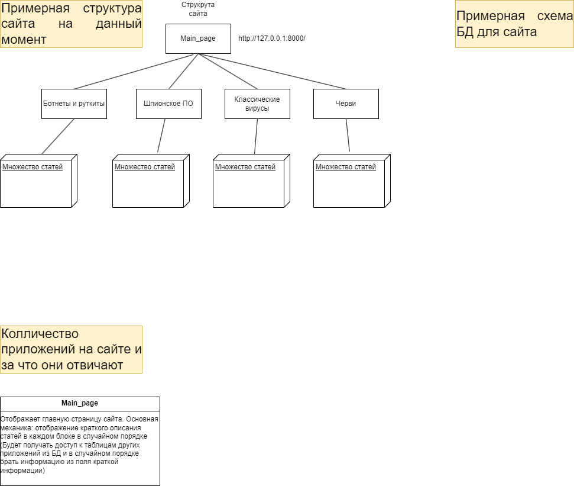

# TOXIS
## Описание 
Проект для создания платформы для информирования пользователей о вирусах

## Работа с git и github
Для начала работы с проектом его надо склонировать
```
$ git clone https://github.com/pro100ren4/toxis.git
``` 
После того как репозиторий проекта склонирован необходимо отделиться от главной
ветки репозитория на свою собственную, где можно творить, что угодно, КРОМЕ
слияния с главной веткой (master) и слияния с веткой разработки (develop).
```
$ git checkout develop
$ git checkout -b <название_ветки>
```
Для получения изменений репозитория с сервера
```
$ git pull
```
Для загрузки изменений на сервер
```
$ git push
```

## Сборка
Для "сборки" проекта необходимо скачать Python и создать виртуальное окружение и 
установить зависимости.

```
# Создание виртуального окружения:
$ python -m venv venv

# Запуск виртуального окружения:
# Windows
$ venv\Scripts\activate.bat
# Linux
$ sourve venv/bin/activate

# Выход из виртуального окружения:
$ deactivate

# Загрузка зависимостей (проводить в виртуальном окружении):
$ pip install -r requirements.txt

# Запуск проекта (проводить в виртуальном окружении):
$ python manage.py runserver
```

## Приложения к проекту
### Примерная схема работы проекта
